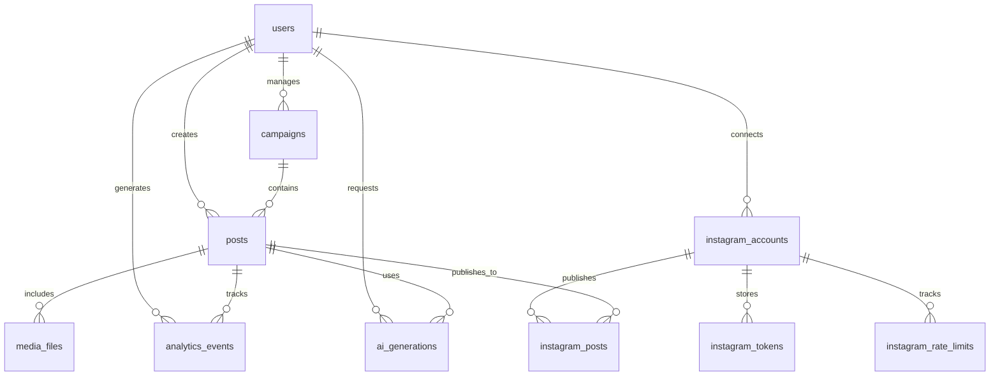

# Database Schema

Complete database schema documentation for the Defeah Marketing Backend.

## Schema Overview

The database is designed around the core entities: Users, Posts, Campaigns, and Instagram integration, with supporting tables for analytics, AI operations, and system management.

## Entity Relationship Diagram



## Core Tables

### Users Table

Primary user account and profile information.

```sql
CREATE TABLE users (
    id UUID PRIMARY KEY DEFAULT gen_random_uuid(),
    
    -- Authentication
    email VARCHAR(255) UNIQUE NOT NULL,
    hashed_password VARCHAR(255) NOT NULL,
    
    -- Profile Information
    full_name VARCHAR(255),
    bio TEXT,
    timezone VARCHAR(50) DEFAULT 'UTC',
    avatar_url TEXT,
    
    -- Account Status
    is_active BOOLEAN DEFAULT true,
    is_verified BOOLEAN DEFAULT false,
    email_verified_at TIMESTAMP,
    last_login_at TIMESTAMP,
    
    -- Preferences
    notification_preferences JSONB DEFAULT '{
        "email_analytics": true,
        "email_post_published": false,
        "push_engagement": true,
        "digest_frequency": "weekly"
    }',
    
    -- Instagram Connection Status
    instagram_connected BOOLEAN DEFAULT false,
    
    -- Subscription Information
    plan_type VARCHAR(50) DEFAULT 'free',
    subscription_expires_at TIMESTAMP,
    
    -- Audit Fields
    created_at TIMESTAMP DEFAULT CURRENT_TIMESTAMP,
    updated_at TIMESTAMP DEFAULT CURRENT_TIMESTAMP,
    deleted_at TIMESTAMP
);

-- Indexes
CREATE INDEX idx_users_email ON users(email) WHERE deleted_at IS NULL;
CREATE INDEX idx_users_active ON users(is_active) WHERE is_active = true;
CREATE INDEX idx_users_plan_type ON users(plan_type);
CREATE INDEX idx_users_created_at ON users(created_at);
```

### Posts Table

Content posts with metadata and status tracking.

```sql
CREATE TABLE posts (
    id UUID PRIMARY KEY DEFAULT gen_random_uuid(),
    user_id UUID NOT NULL REFERENCES users(id) ON DELETE CASCADE,
    campaign_id UUID REFERENCES campaigns(id) ON DELETE SET NULL,
    
    -- Content
    title VARCHAR(500),
    caption TEXT NOT NULL,
    hashtags TEXT[], -- Array of hashtags
    
    -- Media
    media_type VARCHAR(20) NOT NULL CHECK (media_type IN ('image', 'video', 'carousel')),
    media_urls TEXT[] NOT NULL, -- Array of media URLs
    thumbnail_url TEXT,
    
    -- Publishing
    status VARCHAR(20) DEFAULT 'draft' CHECK (status IN ('draft', 'scheduled', 'published', 'failed', 'archived')),
    scheduled_at TIMESTAMP,
    published_at TIMESTAMP,
    
    -- Instagram Integration
    instagram_post_id VARCHAR(100),
    instagram_permalink TEXT,
    
    -- AI Generation
    ai_generated JSONB DEFAULT '{
        "caption_generated": false,
        "hashtags_suggested": false,
        "image_generated": false,
        "generation_cost": 0,
        "model_versions": {}
    }',
    
    -- Performance Tracking
    performance_score DECIMAL(5,2),
    engagement_rate DECIMAL(5,2),
    
    -- Audit Fields
    created_at TIMESTAMP DEFAULT CURRENT_TIMESTAMP,
    updated_at TIMESTAMP DEFAULT CURRENT_TIMESTAMP,
    deleted_at TIMESTAMP
);

-- Indexes
CREATE INDEX idx_posts_user_id ON posts(user_id) WHERE deleted_at IS NULL;
CREATE INDEX idx_posts_campaign_id ON posts(campaign_id) WHERE campaign_id IS NOT NULL;
CREATE INDEX idx_posts_status ON posts(status);
CREATE INDEX idx_posts_scheduled_at ON posts(scheduled_at) WHERE scheduled_at IS NOT NULL;
CREATE INDEX idx_posts_published_at ON posts(published_at) WHERE published_at IS NOT NULL;
CREATE INDEX idx_posts_instagram_id ON posts(instagram_post_id) WHERE instagram_post_id IS NOT NULL;
CREATE INDEX idx_posts_created_at ON posts(created_at);
```

### Campaigns Table

Marketing campaigns with configuration and tracking.

```sql
CREATE TABLE campaigns (
    id UUID PRIMARY KEY DEFAULT gen_random_uuid(),
    user_id UUID NOT NULL REFERENCES users(id) ON DELETE CASCADE,
    
    -- Campaign Details
    name VARCHAR(255) NOT NULL,
    description TEXT,
    theme VARCHAR(100),
    
    -- Status and Timing
    status VARCHAR(20) DEFAULT 'draft' CHECK (status IN ('draft', 'active', 'paused', 'completed', 'archived')),
    start_date TIMESTAMP,
    end_date TIMESTAMP,
    
    -- Budget and Cost Tracking
    budget DECIMAL(10,2) DEFAULT 0,
    spent DECIMAL(10,2) DEFAULT 0,
    cost_per_post DECIMAL(8,2),
    
    -- Content Strategy
    content_strategy JSONB DEFAULT '{
        "posting_frequency": "daily",
        "optimal_times": ["09:00", "15:00", "19:00"],
        "content_types": ["image", "carousel"],
        "tone": "professional_friendly"
    }',
    
    -- AI Configuration
    ai_settings JSONB DEFAULT '{
        "auto_generate_captions": true,
        "auto_suggest_hashtags": true,
        "brand_voice_consistency": 85,
        "content_variety": "medium"
    }',
    
    -- Performance Targets
    target_metrics JSONB DEFAULT '{
        "posts_count": 30,
        "engagement_rate": 5.0,
        "reach_target": 10000,
        "roi_target": 200
    }',
    
    -- Actual Performance
    actual_metrics JSONB DEFAULT '{
        "posts_published": 0,
        "total_engagement": 0,
        "total_reach": 0,
        "conversion_rate": 0
    }',
    
    -- Audit Fields
    created_at TIMESTAMP DEFAULT CURRENT_TIMESTAMP,
    updated_at TIMESTAMP DEFAULT CURRENT_TIMESTAMP,
    deleted_at TIMESTAMP
);

-- Indexes
CREATE INDEX idx_campaigns_user_id ON campaigns(user_id) WHERE deleted_at IS NULL;
CREATE INDEX idx_campaigns_status ON campaigns(status);
CREATE INDEX idx_campaigns_start_date ON campaigns(start_date);
CREATE INDEX idx_campaigns_theme ON campaigns(theme);
CREATE INDEX idx_campaigns_created_at ON campaigns(created_at);
```

## Instagram Integration Tables

### Instagram Accounts Table

Connected Instagram business accounts.

```sql
CREATE TABLE instagram_accounts (
    id UUID PRIMARY KEY DEFAULT gen_random_uuid(),
    user_id UUID NOT NULL REFERENCES users(id) ON DELETE CASCADE,
    
    -- Instagram Account Info
    instagram_user_id VARCHAR(100) UNIQUE NOT NULL,
    username VARCHAR(100) NOT NULL,
    account_type VARCHAR(20) NOT NULL CHECK (account_type IN ('BUSINESS', 'CREATOR')),
    
    -- Profile Data
    profile_picture_url TEXT,
    follower_count INTEGER DEFAULT 0,
    following_count INTEGER DEFAULT 0,
    media_count INTEGER DEFAULT 0,
    
    -- Account Status
    is_active BOOLEAN DEFAULT true,
    is_verified BOOLEAN DEFAULT false,
    connection_status VARCHAR(20) DEFAULT 'connected' CHECK (
        connection_status IN ('connected', 'expired', 'revoked', 'error')
    ),
    
    -- Permissions
    permissions TEXT[] DEFAULT ARRAY['instagram_basic', 'instagram_content_publish'],
    
    -- Audit Fields
    connected_at TIMESTAMP DEFAULT CURRENT_TIMESTAMP,
    last_sync_at TIMESTAMP DEFAULT CURRENT_TIMESTAMP,
    created_at TIMESTAMP DEFAULT CURRENT_TIMESTAMP,
    updated_at TIMESTAMP DEFAULT CURRENT_TIMESTAMP
);

-- Indexes
CREATE INDEX idx_instagram_accounts_user_id ON instagram_accounts(user_id);
CREATE UNIQUE INDEX idx_instagram_accounts_ig_user_id ON instagram_accounts(instagram_user_id);
CREATE INDEX idx_instagram_accounts_username ON instagram_accounts(username);
CREATE INDEX idx_instagram_accounts_status ON instagram_accounts(connection_status);
```

### Instagram Tokens Table

OAuth tokens and refresh data.

```sql
CREATE TABLE instagram_tokens (
    id UUID PRIMARY KEY DEFAULT gen_random_uuid(),
    instagram_account_id UUID NOT NULL REFERENCES instagram_accounts(id) ON DELETE CASCADE,
    
    -- Token Data (encrypted)
    access_token_encrypted TEXT NOT NULL,
    token_type VARCHAR(20) DEFAULT 'bearer',
    
    -- Token Lifecycle
    expires_at TIMESTAMP NOT NULL,
    issued_at TIMESTAMP DEFAULT CURRENT_TIMESTAMP,
    last_refreshed_at TIMESTAMP,
    refresh_count INTEGER DEFAULT 0,
    
    -- Token Scopes
    scopes TEXT[] NOT NULL,
    
    -- Status
    is_active BOOLEAN DEFAULT true,
    revoked_at TIMESTAMP,
    revoked_reason VARCHAR(100),
    
    -- Audit Fields
    created_at TIMESTAMP DEFAULT CURRENT_TIMESTAMP,
    updated_at TIMESTAMP DEFAULT CURRENT_TIMESTAMP
);

-- Indexes
CREATE INDEX idx_instagram_tokens_account_id ON instagram_tokens(instagram_account_id);
CREATE INDEX idx_instagram_tokens_expires_at ON instagram_tokens(expires_at);
CREATE INDEX idx_instagram_tokens_active ON instagram_tokens(is_active) WHERE is_active = true;
```

### Instagram Rate Limits Table

API rate limiting tracking.

```sql
CREATE TABLE instagram_rate_limits (
    id UUID PRIMARY KEY DEFAULT gen_random_uuid(),
    instagram_account_id UUID NOT NULL REFERENCES instagram_accounts(id) ON DELETE CASCADE,
    
    -- Rate Limit Window
    window_start TIMESTAMP NOT NULL,
    window_end TIMESTAMP NOT NULL,
    window_type VARCHAR(20) DEFAULT 'hourly' CHECK (window_type IN ('hourly', 'daily')),
    
    -- Request Tracking
    requests_made INTEGER DEFAULT 0,
    requests_limit INTEGER NOT NULL,
    requests_remaining INTEGER NOT NULL,
    
    -- API Endpoint Tracking
    endpoint_counts JSONB DEFAULT '{}', -- Track per-endpoint usage
    
    -- Status
    limit_exceeded BOOLEAN DEFAULT false,
    reset_at TIMESTAMP,
    
    -- Audit Fields
    created_at TIMESTAMP DEFAULT CURRENT_TIMESTAMP,
    updated_at TIMESTAMP DEFAULT CURRENT_TIMESTAMP,
    
    UNIQUE(instagram_account_id, window_start, window_type)
);

-- Indexes
CREATE INDEX idx_instagram_rate_limits_account_id ON instagram_rate_limits(instagram_account_id);
CREATE INDEX idx_instagram_rate_limits_window ON instagram_rate_limits(window_start, window_end);
CREATE INDEX idx_instagram_rate_limits_exceeded ON instagram_rate_limits(limit_exceeded) WHERE limit_exceeded = true;
```

### Instagram Posts Table

Published Instagram posts tracking.

```sql
CREATE TABLE instagram_posts (
    id UUID PRIMARY KEY DEFAULT gen_random_uuid(),
    post_id UUID NOT NULL REFERENCES posts(id) ON DELETE CASCADE,
    instagram_account_id UUID NOT NULL REFERENCES instagram_accounts(id) ON DELETE CASCADE,
    
    -- Instagram Post Data
    instagram_post_id VARCHAR(100) UNIQUE NOT NULL,
    instagram_permalink TEXT,
    post_type VARCHAR(20) NOT NULL CHECK (post_type IN ('IMAGE', 'VIDEO', 'CAROUSEL_ALBUM')),
    
    -- Content
    caption TEXT,
    hashtags TEXT[],
    media_urls TEXT[] NOT NULL,
    
    -- Publishing Details
    published_at TIMESTAMP NOT NULL,
    publish_response JSONB, -- Full API response
    
    -- Performance Data (cached from Instagram Insights)
    insights JSONB DEFAULT '{
        "impressions": 0,
        "reach": 0,
        "likes": 0,
        "comments": 0,
        "shares": 0,
        "saves": 0,
        "profile_visits": 0,
        "website_clicks": 0,
        "last_updated": null
    }',
    
    -- Status
    is_active BOOLEAN DEFAULT true,
    deleted_from_instagram BOOLEAN DEFAULT false,
    
    -- Audit Fields
    created_at TIMESTAMP DEFAULT CURRENT_TIMESTAMP,
    updated_at TIMESTAMP DEFAULT CURRENT_TIMESTAMP
);

-- Indexes
CREATE INDEX idx_instagram_posts_post_id ON instagram_posts(post_id);
CREATE INDEX idx_instagram_posts_account_id ON instagram_posts(instagram_account_id);
CREATE UNIQUE INDEX idx_instagram_posts_ig_post_id ON instagram_posts(instagram_post_id);
CREATE INDEX idx_instagram_posts_published_at ON instagram_posts(published_at);
CREATE INDEX idx_instagram_posts_active ON instagram_posts(is_active) WHERE is_active = true;
```

## Analytics and AI Tables

### Analytics Events Table

User engagement and system events tracking.

```sql
CREATE TABLE analytics_events (
    id UUID PRIMARY KEY DEFAULT gen_random_uuid(),
    
    -- Event Context
    user_id UUID REFERENCES users(id) ON DELETE SET NULL,
    post_id UUID REFERENCES posts(id) ON DELETE SET NULL,
    campaign_id UUID REFERENCES campaigns(id) ON DELETE SET NULL,
    
    -- Event Details
    event_type VARCHAR(50) NOT NULL,
    event_category VARCHAR(50) NOT NULL,
    event_action VARCHAR(50) NOT NULL,
    
    -- Event Data
    properties JSONB DEFAULT '{}',
    
    -- Context
    session_id UUID,
    user_agent TEXT,
    ip_address INET,
    referrer TEXT,
    
    -- Timing
    timestamp TIMESTAMP DEFAULT CURRENT_TIMESTAMP,
    
    -- Processing
    processed BOOLEAN DEFAULT false,
    processed_at TIMESTAMP
);

-- Indexes (Partitioned by timestamp for performance)
CREATE INDEX idx_analytics_events_user_id ON analytics_events(user_id, timestamp);
CREATE INDEX idx_analytics_events_post_id ON analytics_events(post_id, timestamp);
CREATE INDEX idx_analytics_events_campaign_id ON analytics_events(campaign_id, timestamp);
CREATE INDEX idx_analytics_events_type ON analytics_events(event_type, timestamp);
CREATE INDEX idx_analytics_events_timestamp ON analytics_events(timestamp);
CREATE INDEX idx_analytics_events_processed ON analytics_events(processed) WHERE processed = false;

-- Partition by month for better performance
CREATE TABLE analytics_events_y2024m01 PARTITION OF analytics_events
    FOR VALUES FROM ('2024-01-01') TO ('2024-02-01');
-- Additional partitions would be created monthly
```

### AI Generations Table

AI content generation tracking and cost management.

```sql
CREATE TABLE ai_generations (
    id UUID PRIMARY KEY DEFAULT gen_random_uuid(),
    
    -- Context
    user_id UUID NOT NULL REFERENCES users(id) ON DELETE CASCADE,
    post_id UUID REFERENCES posts(id) ON DELETE CASCADE,
    campaign_id UUID REFERENCES campaigns(id) ON DELETE SET NULL,
    
    -- Generation Details
    generation_type VARCHAR(30) NOT NULL CHECK (generation_type IN (
        'caption', 'hashtags', 'image', 'video_thumbnail', 'content_analysis'
    )),
    model_provider VARCHAR(20) NOT NULL CHECK (model_provider IN ('openai', 'anthropic', 'stability')),
    model_name VARCHAR(50) NOT NULL,
    model_version VARCHAR(20),
    
    -- Input/Output
    input_data JSONB NOT NULL,
    output_data JSONB NOT NULL,
    prompt_tokens INTEGER,
    completion_tokens INTEGER,
    
    -- Quality Metrics
    quality_score DECIMAL(4,2),
    brand_consistency_score DECIMAL(4,2),
    user_rating INTEGER CHECK (user_rating >= 1 AND user_rating <= 5),
    
    -- Cost Tracking
    cost_usd DECIMAL(8,4) NOT NULL,
    cost_currency VARCHAR(3) DEFAULT 'USD',
    
    -- Performance
    generation_time_ms INTEGER,
    retry_count INTEGER DEFAULT 0,
    
    -- Status
    status VARCHAR(20) DEFAULT 'completed' CHECK (status IN ('pending', 'completed', 'failed', 'cancelled')),
    error_message TEXT,
    
    -- Audit Fields
    created_at TIMESTAMP DEFAULT CURRENT_TIMESTAMP,
    updated_at TIMESTAMP DEFAULT CURRENT_TIMESTAMP
);

-- Indexes
CREATE INDEX idx_ai_generations_user_id ON ai_generations(user_id, created_at);
CREATE INDEX idx_ai_generations_post_id ON ai_generations(post_id) WHERE post_id IS NOT NULL;
CREATE INDEX idx_ai_generations_type ON ai_generations(generation_type, created_at);
CREATE INDEX idx_ai_generations_provider ON ai_generations(model_provider, created_at);
CREATE INDEX idx_ai_generations_cost ON ai_generations(cost_usd, created_at);
CREATE INDEX idx_ai_generations_status ON ai_generations(status) WHERE status != 'completed';
```

### Media Files Table

Uploaded media assets and processing status.

```sql
CREATE TABLE media_files (
    id UUID PRIMARY KEY DEFAULT gen_random_uuid(),
    
    -- Ownership
    user_id UUID NOT NULL REFERENCES users(id) ON DELETE CASCADE,
    post_id UUID REFERENCES posts(id) ON DELETE CASCADE,
    
    -- File Details
    filename VARCHAR(255) NOT NULL,
    original_filename VARCHAR(255) NOT NULL,
    file_size INTEGER NOT NULL,
    mime_type VARCHAR(100) NOT NULL,
    
    -- Storage
    storage_provider VARCHAR(20) DEFAULT 'local' CHECK (storage_provider IN ('local', 's3', 'gcs', 'azure')),
    storage_path TEXT NOT NULL,
    public_url TEXT,
    
    -- Media Properties
    media_type VARCHAR(20) NOT NULL CHECK (media_type IN ('image', 'video', 'audio', 'document')),
    dimensions JSONB, -- {width: 1920, height: 1080}
    duration INTEGER, -- For video/audio in seconds
    
    -- Processing Status
    processing_status VARCHAR(20) DEFAULT 'pending' CHECK (processing_status IN (
        'pending', 'processing', 'completed', 'failed'
    )),
    processed_variants JSONB DEFAULT '{}', -- Different sizes/formats
    
    -- Metadata
    exif_data JSONB,
    alt_text TEXT,
    tags TEXT[],
    
    -- AI Analysis
    ai_analysis JSONB DEFAULT '{
        "objects_detected": [],
        "colors": [],
        "style": "",
        "quality_score": null,
        "brand_alignment": null
    }',
    
    -- Audit Fields
    uploaded_at TIMESTAMP DEFAULT CURRENT_TIMESTAMP,
    processed_at TIMESTAMP,
    created_at TIMESTAMP DEFAULT CURRENT_TIMESTAMP,
    updated_at TIMESTAMP DEFAULT CURRENT_TIMESTAMP,
    deleted_at TIMESTAMP
);

-- Indexes
CREATE INDEX idx_media_files_user_id ON media_files(user_id) WHERE deleted_at IS NULL;
CREATE INDEX idx_media_files_post_id ON media_files(post_id) WHERE post_id IS NOT NULL;
CREATE INDEX idx_media_files_type ON media_files(media_type);
CREATE INDEX idx_media_files_processing ON media_files(processing_status) WHERE processing_status != 'completed';
CREATE INDEX idx_media_files_uploaded_at ON media_files(uploaded_at);
```

## System Tables

### User Sessions Table

Active user sessions for security and analytics.

```sql
CREATE TABLE user_sessions (
    id UUID PRIMARY KEY DEFAULT gen_random_uuid(),
    user_id UUID NOT NULL REFERENCES users(id) ON DELETE CASCADE,
    
    -- Session Data
    session_token VARCHAR(255) UNIQUE NOT NULL,
    refresh_token VARCHAR(255) UNIQUE,
    
    -- Device Information
    device_type VARCHAR(20),
    device_name VARCHAR(100),
    browser VARCHAR(50),
    os VARCHAR(50),
    ip_address INET,
    location JSONB, -- {country, city, coordinates}
    
    -- Session Lifecycle
    expires_at TIMESTAMP NOT NULL,
    last_activity_at TIMESTAMP DEFAULT CURRENT_TIMESTAMP,
    is_active BOOLEAN DEFAULT true,
    
    -- Security
    login_method VARCHAR(20) DEFAULT 'password' CHECK (login_method IN ('password', 'oauth', 'sso')),
    mfa_verified BOOLEAN DEFAULT false,
    suspicious_activity BOOLEAN DEFAULT false,
    
    -- Audit Fields
    created_at TIMESTAMP DEFAULT CURRENT_TIMESTAMP,
    ended_at TIMESTAMP
);

-- Indexes
CREATE INDEX idx_user_sessions_user_id ON user_sessions(user_id, last_activity_at);
CREATE UNIQUE INDEX idx_user_sessions_token ON user_sessions(session_token) WHERE is_active = true;
CREATE INDEX idx_user_sessions_expires_at ON user_sessions(expires_at);
CREATE INDEX idx_user_sessions_active ON user_sessions(is_active) WHERE is_active = true;
CREATE INDEX idx_user_sessions_suspicious ON user_sessions(suspicious_activity) WHERE suspicious_activity = true;
```

### System Configuration Table

Application configuration and feature flags.

```sql
CREATE TABLE system_config (
    id UUID PRIMARY KEY DEFAULT gen_random_uuid(),
    
    -- Configuration
    config_key VARCHAR(100) UNIQUE NOT NULL,
    config_value JSONB NOT NULL,
    config_type VARCHAR(20) DEFAULT 'setting' CHECK (config_type IN (
        'setting', 'feature_flag', 'limit', 'secret'
    )),
    
    -- Metadata
    description TEXT,
    environment VARCHAR(20) DEFAULT 'all' CHECK (environment IN ('all', 'development', 'staging', 'production')),
    
    -- Status
    is_active BOOLEAN DEFAULT true,
    is_encrypted BOOLEAN DEFAULT false,
    
    -- Audit Fields
    created_at TIMESTAMP DEFAULT CURRENT_TIMESTAMP,
    updated_at TIMESTAMP DEFAULT CURRENT_TIMESTAMP,
    created_by UUID REFERENCES users(id)
);

-- Indexes
CREATE UNIQUE INDEX idx_system_config_key ON system_config(config_key, environment);
CREATE INDEX idx_system_config_type ON system_config(config_type);
CREATE INDEX idx_system_config_active ON system_config(is_active) WHERE is_active = true;
```

## Data Constraints and Business Rules

### Referential Integrity
```sql
-- Ensure posts belong to campaigns of the same user
ALTER TABLE posts ADD CONSTRAINT posts_campaign_user_check 
    CHECK (
        campaign_id IS NULL OR 
        user_id = (SELECT user_id FROM campaigns WHERE id = campaign_id)
    );

-- Ensure Instagram posts have valid post references
ALTER TABLE instagram_posts ADD CONSTRAINT instagram_posts_valid_post_check
    CHECK (
        post_id IN (SELECT id FROM posts WHERE deleted_at IS NULL)
    );
```

### Data Validation
```sql
-- Email format validation
ALTER TABLE users ADD CONSTRAINT users_email_format_check
    CHECK (email ~* '^[A-Za-z0-9._%+-]+@[A-Za-z0-9.-]+\.[A-Za-z]{2,}$');

-- Password strength (minimum 8 characters)
ALTER TABLE users ADD CONSTRAINT users_password_strength_check
    CHECK (LENGTH(hashed_password) >= 60); -- bcrypt hash length

-- Post caption length
ALTER TABLE posts ADD CONSTRAINT posts_caption_length_check
    CHECK (LENGTH(caption) <= 2200); -- Instagram limit

-- Campaign date validation
ALTER TABLE campaigns ADD CONSTRAINT campaigns_date_order_check
    CHECK (start_date IS NULL OR end_date IS NULL OR start_date <= end_date);
```

### Performance Constraints
```sql
-- Limit hashtags per post (Instagram limit is 30)
ALTER TABLE posts ADD CONSTRAINT posts_hashtag_limit_check
    CHECK (array_length(hashtags, 1) IS NULL OR array_length(hashtags, 1) <= 30);

-- Limit media files per post
ALTER TABLE posts ADD CONSTRAINT posts_media_limit_check
    CHECK (array_length(media_urls, 1) IS NULL OR array_length(media_urls, 1) <= 10);
```

## Database Functions and Triggers

### Automatic Timestamp Updates
```sql
-- Function to update updated_at timestamp
CREATE OR REPLACE FUNCTION update_updated_at_column()
RETURNS TRIGGER AS $$
BEGIN
    NEW.updated_at = CURRENT_TIMESTAMP;
    RETURN NEW;
END;
$$ language 'plpgsql';

-- Apply to all tables with updated_at column
CREATE TRIGGER update_users_updated_at BEFORE UPDATE ON users
    FOR EACH ROW EXECUTE FUNCTION update_updated_at_column();

CREATE TRIGGER update_posts_updated_at BEFORE UPDATE ON posts
    FOR EACH ROW EXECUTE FUNCTION update_updated_at_column();

CREATE TRIGGER update_campaigns_updated_at BEFORE UPDATE ON campaigns
    FOR EACH ROW EXECUTE FUNCTION update_updated_at_column();
```

### Audit Logging
```sql
-- Function to log data changes
CREATE OR REPLACE FUNCTION log_data_changes()
RETURNS TRIGGER AS $$
BEGIN
    IF TG_OP = 'INSERT' THEN
        INSERT INTO audit_logs (table_name, operation, user_id, new_values)
        VALUES (TG_TABLE_NAME, TG_OP, NEW.user_id, row_to_json(NEW));
        RETURN NEW;
    ELSIF TG_OP = 'UPDATE' THEN
        INSERT INTO audit_logs (table_name, operation, user_id, old_values, new_values)
        VALUES (TG_TABLE_NAME, TG_OP, NEW.user_id, row_to_json(OLD), row_to_json(NEW));
        RETURN NEW;
    ELSIF TG_OP = 'DELETE' THEN
        INSERT INTO audit_logs (table_name, operation, user_id, old_values)
        VALUES (TG_TABLE_NAME, TG_OP, OLD.user_id, row_to_json(OLD));
        RETURN OLD;
    END IF;
    RETURN NULL;
END;
$$ language 'plpgsql';

-- Apply audit logging to sensitive tables
CREATE TRIGGER audit_users_changes AFTER INSERT OR UPDATE OR DELETE ON users
    FOR EACH ROW EXECUTE FUNCTION log_data_changes();
```

## Views for Common Queries

### User Dashboard View
```sql
CREATE VIEW user_dashboard AS
SELECT 
    u.id as user_id,
    u.email,
    u.full_name,
    u.plan_type,
    u.instagram_connected,
    
    -- Post Statistics
    COUNT(DISTINCT p.id) as total_posts,
    COUNT(DISTINCT CASE WHEN p.status = 'published' THEN p.id END) as published_posts,
    COUNT(DISTINCT CASE WHEN p.scheduled_at > CURRENT_TIMESTAMP THEN p.id END) as scheduled_posts,
    
    -- Campaign Statistics
    COUNT(DISTINCT c.id) as total_campaigns,
    COUNT(DISTINCT CASE WHEN c.status = 'active' THEN c.id END) as active_campaigns,
    
    -- AI Usage
    COUNT(DISTINCT ai.id) as ai_generations,
    COALESCE(SUM(ai.cost_usd), 0) as total_ai_cost,
    
    -- Last Activity
    MAX(p.created_at) as last_post_created,
    u.last_login_at
    
FROM users u
LEFT JOIN posts p ON u.id = p.user_id AND p.deleted_at IS NULL
LEFT JOIN campaigns c ON u.id = c.user_id AND c.deleted_at IS NULL
LEFT JOIN ai_generations ai ON u.id = ai.user_id AND ai.created_at >= CURRENT_DATE - INTERVAL '30 days'
WHERE u.deleted_at IS NULL
GROUP BY u.id, u.email, u.full_name, u.plan_type, u.instagram_connected, u.last_login_at;
```

### Campaign Performance View
```sql
CREATE VIEW campaign_performance AS
SELECT 
    c.id as campaign_id,
    c.name,
    c.status,
    c.budget,
    c.spent,
    c.start_date,
    c.end_date,
    
    -- Post Metrics
    COUNT(p.id) as total_posts,
    COUNT(CASE WHEN p.status = 'published' THEN 1 END) as published_posts,
    
    -- Instagram Performance
    AVG(CAST(ip.insights->>'likes' AS INTEGER)) as avg_likes,
    AVG(CAST(ip.insights->>'comments' AS INTEGER)) as avg_comments,
    AVG(CAST(ip.insights->>'reach' AS INTEGER)) as avg_reach,
    SUM(CAST(ip.insights->>'impressions' AS INTEGER)) as total_impressions,
    
    -- Engagement Rate
    CASE 
        WHEN SUM(CAST(ip.insights->>'reach' AS INTEGER)) > 0 THEN
            (SUM(CAST(ip.insights->>'likes' AS INTEGER)) + SUM(CAST(ip.insights->>'comments' AS INTEGER))) * 100.0 / 
            SUM(CAST(ip.insights->>'reach' AS INTEGER))
        ELSE 0
    END as engagement_rate,
    
    -- ROI Calculation
    CASE 
        WHEN c.spent > 0 THEN
            (SUM(CAST(ip.insights->>'impressions' AS INTEGER)) * 0.001 - c.spent) * 100.0 / c.spent
        ELSE 0
    END as roi_percentage
    
FROM campaigns c
LEFT JOIN posts p ON c.id = p.campaign_id AND p.deleted_at IS NULL
LEFT JOIN instagram_posts ip ON p.id = ip.post_id
WHERE c.deleted_at IS NULL
GROUP BY c.id, c.name, c.status, c.budget, c.spent, c.start_date, c.end_date;
```

This comprehensive schema provides the foundation for all planned features while maintaining data integrity, performance, and scalability.