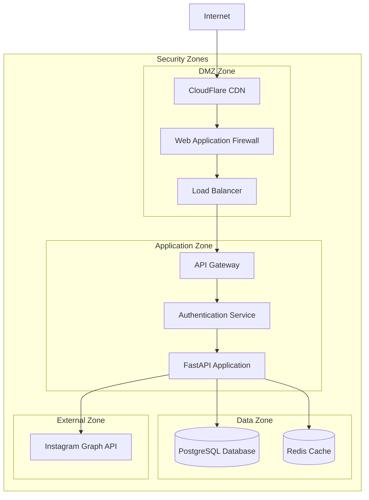
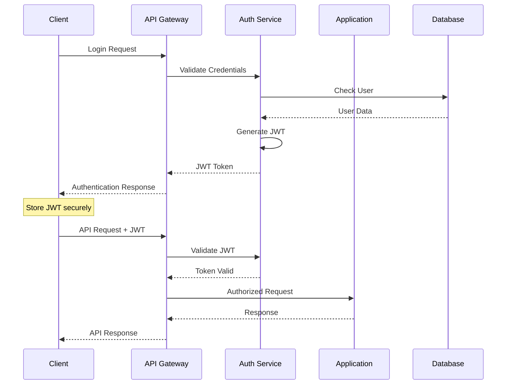
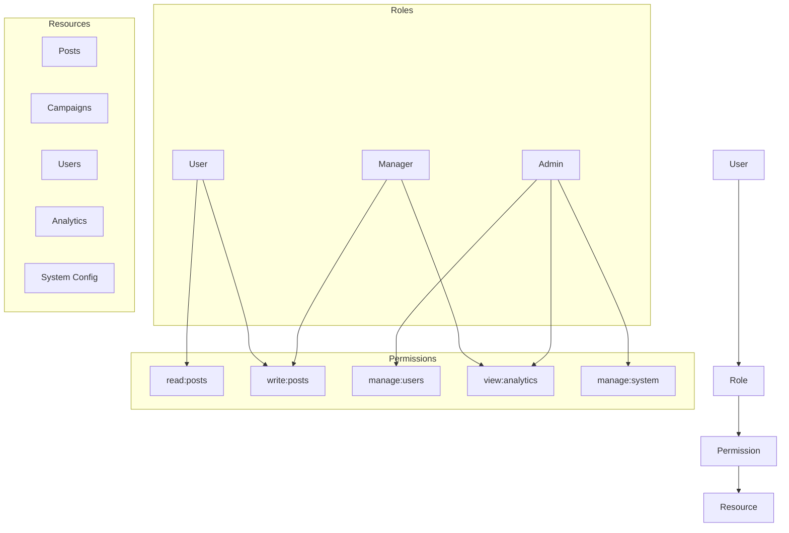
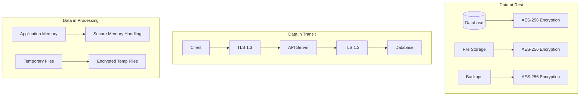

# Security Architecture

Comprehensive security architecture design for the Defeah Marketing Backend system.

## Architecture Overview

### Security-First Design Principles

The Defeah Marketing Backend follows a **Zero Trust Architecture** with defense-in-depth security layers:

1. **Never Trust, Always Verify**: Every request is authenticated and authorized
2. **Least Privilege Access**: Users get minimum necessary permissions
3. **Assume Breach**: Design for containment and rapid response
4. **Defense in Depth**: Multiple security layers and controls
5. **Continuous Monitoring**: Real-time security monitoring and alerting

### High-Level Security Architecture



## Security Zones and Network Architecture

### Zone Segmentation

#### DMZ Zone (Public-Facing)
- **Components**: CDN, WAF, Load Balancer
- **Purpose**: First line of defense, traffic filtering
- **Security Controls**:
  - DDoS protection
  - Rate limiting
  - Geographic filtering
  - Bot protection

#### Application Zone (Private)
- **Components**: API Gateway, Authentication Service, FastAPI Application
- **Purpose**: Business logic and API endpoints
- **Security Controls**:
  - JWT authentication
  - Role-based authorization
  - Input validation
  - Output encoding

#### Data Zone (Highly Restricted)
- **Components**: PostgreSQL, Redis
- **Purpose**: Data storage and caching
- **Security Controls**:
  - Encryption at rest
  - Network isolation
  - Access logging
  - Backup encryption

#### External Zone (Third-Party)
- **Components**: Instagram Graph API, AI Services
- **Purpose**: External integrations
- **Security Controls**:
  - OAuth 2.0 authentication
  - API rate limiting
  - Token encryption
  - Compliance monitoring

### Network Security Controls

```yaml
# Network Security Configuration
network_security:
  zones:
    dmz:
      ingress:
        - source: "0.0.0.0/0"
          ports: [80, 443]
          protocol: "TCP"
      egress:
        - destination: "application_zone"
          ports: [8080]
          protocol: "TCP"
    
    application:
      ingress:
        - source: "dmz_zone"
          ports: [8080]
          protocol: "TCP"
      egress:
        - destination: "data_zone"
          ports: [5432, 6379]
          protocol: "TCP"
        - destination: "external_apis"
          ports: [443]
          protocol: "TCP"
    
    data:
      ingress:
        - source: "application_zone"
          ports: [5432, 6379]
          protocol: "TCP"
      egress: []  # No outbound connections
```

## Authentication Architecture

### JWT Authentication Flow



### Token Security Architecture

#### JWT Token Structure
```json
{
  "header": {
    "alg": "HS256",
    "typ": "JWT"
  },
  "payload": {
    "sub": "user_id",
    "email": "user@example.com",
    "roles": ["user"],
    "permissions": ["read:posts", "write:posts"],
    "exp": 1642869000,
    "iat": 1642262200,
    "jti": "unique_token_id"
  },
  "signature": "HMAC_SHA256_signature"
}
```

#### Token Security Features
- **Short Expiration**: 7 days maximum
- **Unique Identifier**: JTI for token blacklisting
- **Minimal Claims**: Only essential information
- **Secure Signing**: HMAC-SHA256 with rotating keys
- **Refresh Mechanism**: Secure token renewal

### Authentication Security Controls

```python
# Authentication Configuration
AUTHENTICATION_CONFIG = {
    "jwt": {
        "algorithm": "HS256",
        "access_token_expire_minutes": 10080,  # 7 days
        "refresh_token_expire_days": 30,
        "issuer": "defeah-marketing-api",
        "audience": "defeah-marketing-app"
    },
    "password_policy": {
        "min_length": 12,
        "require_uppercase": True,
        "require_lowercase": True,
        "require_numbers": True,
        "require_special_chars": True,
        "max_age_days": 90,
        "history_count": 5
    },
    "rate_limiting": {
        "login_attempts": {
            "max_attempts": 5,
            "window_minutes": 15,
            "lockout_minutes": 30
        },
        "token_refresh": {
            "max_requests": 100,
            "window_hours": 1
        }
    }
}
```

## Authorization Architecture

### Role-Based Access Control (RBAC)



### Permission Matrix

| Role | Posts | Campaigns | Analytics | Users | System | Instagram |
|------|-------|-----------|-----------|-------|--------|-----------|
| **Admin** | CRUD | CRUD | Read | CRUD | CRUD | Manage |
| **Manager** | CRUD | CRUD | Read | Read | - | Manage |
| **User** | CRUD (own) | CRUD (own) | Read (own) | Read (self) | - | Manage (own) |
| **Viewer** | Read | Read | - | - | - | - |

### Authorization Implementation

```python
# Authorization Decorator
from functools import wraps
from fastapi import HTTPException, Depends
from app.core.auth import get_current_user

def require_permission(permission: str, resource_id: str = None):
    def decorator(func):
        @wraps(func)
        async def wrapper(*args, **kwargs):
            current_user = Depends(get_current_user)
            
            # Check user has required permission
            if not user_has_permission(current_user, permission):
                raise HTTPException(
                    status_code=403,
                    detail="Insufficient permissions"
                )
            
            # Resource-level authorization
            if resource_id and not user_can_access_resource(
                current_user, resource_id
            ):
                raise HTTPException(
                    status_code=403,
                    detail="Resource access denied"
                )
            
            return await func(*args, **kwargs)
        return wrapper
    return decorator

# Usage Example
@router.get("/posts/{post_id}")
@require_permission("read:posts", "post_id")
async def get_post(post_id: str):
    return await post_service.get_post(post_id)
```

## Data Protection Architecture

### Encryption Strategy



### Encryption Implementation

```python
# Encryption Configuration
ENCRYPTION_CONFIG = {
    "database": {
        "algorithm": "AES-256-GCM",
        "key_rotation_days": 90,
        "backup_encryption": True
    },
    "application": {
        "sensitive_fields": [
            "password",
            "instagram_token",
            "personal_data"
        ],
        "encryption_library": "cryptography",
        "key_derivation": "PBKDF2"
    },
    "transport": {
        "tls_version": "1.3",
        "cipher_suites": [
            "TLS_AES_256_GCM_SHA384",
            "TLS_CHACHA20_POLY1305_SHA256"
        ],
        "certificate_validation": True
    }
}

# Field-Level Encryption
from cryptography.fernet import Fernet

class EncryptedField:
    def __init__(self, key: bytes):
        self.cipher = Fernet(key)
    
    def encrypt(self, value: str) -> str:
        return self.cipher.encrypt(value.encode()).decode()
    
    def decrypt(self, encrypted_value: str) -> str:
        return self.cipher.decrypt(encrypted_value.encode()).decode()

# Database Model with Encryption
class User(Base):
    __tablename__ = "users"
    
    id = Column(UUID, primary_key=True)
    email = Column(String, nullable=False)
    _instagram_token = Column("instagram_token", Text)
    
    @property
    def instagram_token(self) -> str:
        if self._instagram_token:
            return encrypted_field.decrypt(self._instagram_token)
        return None
    
    @instagram_token.setter
    def instagram_token(self, value: str):
        if value:
            self._instagram_token = encrypted_field.encrypt(value)
        else:
            self._instagram_token = None
```

### PII Data Handling

```python
# PII Classification and Handling
PII_CLASSIFICATION = {
    "sensitive": {
        "fields": ["ssn", "credit_card", "bank_account"],
        "encryption": "required",
        "access_logging": "required",
        "retention_days": 0  # Delete immediately after use
    },
    "personal": {
        "fields": ["email", "phone", "address", "full_name"],
        "encryption": "recommended",
        "access_logging": "required",
        "retention_days": 2555  # 7 years
    },
    "public": {
        "fields": ["username", "profile_picture"],
        "encryption": "optional",
        "access_logging": "optional",
        "retention_days": 3650  # 10 years
    }
}

# Automatic PII Detection
import re

class PIIDetector:
    patterns = {
        "email": r'\b[A-Za-z0-9._%+-]+@[A-Za-z0-9.-]+\.[A-Z|a-z]{2,}\b',
        "phone": r'\b\d{3}-?\d{3}-?\d{4}\b',
        "ssn": r'\b\d{3}-?\d{2}-?\d{4}\b',
        "credit_card": r'\b\d{4}[- ]?\d{4}[- ]?\d{4}[- ]?\d{4}\b'
    }
    
    def detect_pii(self, text: str) -> dict:
        detected = {}
        for pii_type, pattern in self.patterns.items():
            matches = re.findall(pattern, text)
            if matches:
                detected[pii_type] = matches
        return detected
    
    def sanitize_text(self, text: str) -> str:
        sanitized = text
        for pii_type, pattern in self.patterns.items():
            sanitized = re.sub(pattern, f"[{pii_type.upper()}_REDACTED]", sanitized)
        return sanitized
```

## API Security Architecture

### Input Validation and Sanitization

```python
# Comprehensive Input Validation
from pydantic import BaseModel, validator, Field
from typing import List, Optional
import re

class PostCreateRequest(BaseModel):
    title: Optional[str] = Field(None, max_length=500, min_length=1)
    caption: str = Field(..., max_length=2200, min_length=1)
    hashtags: Optional[List[str]] = Field(None, max_items=30)
    media_urls: List[str] = Field(..., min_items=1, max_items=10)
    
    @validator('caption')
    def validate_caption(cls, v):
        # Remove potentially malicious content
        if re.search(r'<script|javascript:|data:', v, re.IGNORECASE):
            raise ValueError("Invalid content detected")
        return v.strip()
    
    @validator('hashtags', each_item=True)
    def validate_hashtags(cls, v):
        if not re.match(r'^[a-zA-Z0-9_]+$', v):
            raise ValueError("Invalid hashtag format")
        return v.lower()
    
    @validator('media_urls', each_item=True)
    def validate_media_urls(cls, v):
        if not re.match(r'^https?://', v):
            raise ValueError("Only HTTP(S) URLs allowed")
        return v

# SQL Injection Prevention
from sqlalchemy import text

# GOOD: Parameterized query
def get_user_posts(user_id: str, limit: int = 10):
    query = text("""
        SELECT * FROM posts 
        WHERE user_id = :user_id 
        AND deleted_at IS NULL
        ORDER BY created_at DESC
        LIMIT :limit
    """)
    return db.execute(query, {"user_id": user_id, "limit": limit})

# BAD: String concatenation (vulnerable to SQL injection)
# def get_user_posts_bad(user_id: str):
#     query = f"SELECT * FROM posts WHERE user_id = '{user_id}'"
#     return db.execute(query)
```

### Rate Limiting Architecture

```python
# Rate Limiting Implementation
import asyncio
from typing import Dict, Tuple
import time
import redis

class RateLimiter:
    def __init__(self, redis_client: redis.Redis):
        self.redis = redis_client
    
    async def is_rate_limited(
        self, 
        identifier: str, 
        limit: int, 
        window: int
    ) -> Tuple[bool, dict]:
        """
        Check if request is rate limited
        Returns: (is_limited, rate_info)
        """
        current_time = int(time.time())
        window_start = current_time - (current_time % window)
        key = f"rate_limit:{identifier}:{window_start}"
        
        # Use Redis pipeline for atomic operations
        pipe = self.redis.pipeline()
        pipe.incr(key)
        pipe.expire(key, window)
        results = pipe.execute()
        
        current_requests = results[0]
        remaining = max(0, limit - current_requests)
        reset_time = window_start + window
        
        rate_info = {
            "limit": limit,
            "remaining": remaining,
            "reset": reset_time,
            "retry_after": reset_time - current_time if current_requests > limit else 0
        }
        
        return current_requests > limit, rate_info

# Rate Limiting Middleware
from fastapi import Request, Response
from fastapi.responses import JSONResponse

RATE_LIMITS = {
    "global": {"limit": 1000, "window": 3600},  # 1000/hour
    "auth": {"limit": 10, "window": 900},       # 10/15min
    "api": {"limit": 100, "window": 3600},      # 100/hour per user
    "instagram": {"limit": 200, "window": 3600} # Instagram API limits
}

async def rate_limit_middleware(request: Request, call_next):
    # Determine rate limit key and rules
    if request.url.path.startswith("/api/v1/auth"):
        rule = RATE_LIMITS["auth"]
        key = f"auth:{request.client.host}"
    elif request.url.path.startswith("/api/v1/instagram"):
        rule = RATE_LIMITS["instagram"]
        user_id = get_user_id_from_token(request)
        key = f"instagram:{user_id}"
    else:
        rule = RATE_LIMITS["api"]
        user_id = get_user_id_from_token(request)
        key = f"api:{user_id}" if user_id else f"global:{request.client.host}"
    
    # Check rate limit
    is_limited, rate_info = await rate_limiter.is_rate_limited(
        key, rule["limit"], rule["window"]
    )
    
    if is_limited:
        return JSONResponse(
            status_code=429,
            content={"error": "Rate limit exceeded"},
            headers={
                "X-RateLimit-Limit": str(rate_info["limit"]),
                "X-RateLimit-Remaining": str(rate_info["remaining"]),
                "X-RateLimit-Reset": str(rate_info["reset"]),
                "Retry-After": str(rate_info["retry_after"])
            }
        )
    
    response = await call_next(request)
    
    # Add rate limit headers
    response.headers["X-RateLimit-Limit"] = str(rate_info["limit"])
    response.headers["X-RateLimit-Remaining"] = str(rate_info["remaining"])
    response.headers["X-RateLimit-Reset"] = str(rate_info["reset"])
    
    return response
```

## Infrastructure Security

### Container Security

```dockerfile
# Secure Dockerfile
FROM python:3.11-slim-bullseye as builder

# Create non-root user
RUN groupadd -r appuser && useradd -r -g appuser appuser

# Install dependencies
COPY requirements.txt .
RUN pip install --no-cache-dir -r requirements.txt

FROM python:3.11-slim-bullseye

# Copy user from builder
COPY --from=builder /etc/passwd /etc/passwd
COPY --from=builder /etc/group /etc/group

# Install dependencies
COPY --from=builder /usr/local/lib/python3.11/site-packages /usr/local/lib/python3.11/site-packages

# Set up application
WORKDIR /app
COPY --chown=appuser:appuser app/ .

# Security configurations
USER appuser
EXPOSE 8080

# Security options
LABEL security.scan="enabled"
LABEL security.updates="auto"

# Health check
HEALTHCHECK --interval=30s --timeout=3s --start-period=5s --retries=3 \
    CMD curl -f http://localhost:8080/health || exit 1

CMD ["uvicorn", "main:app", "--host", "0.0.0.0", "--port", "8080"]
```

```yaml
# Docker Compose Security Configuration
version: '3.8'
services:
  web:
    build: .
    security_opt:
      - no-new-privileges:true
      - seccomp:default
      - apparmor:docker-default
    cap_drop:
      - ALL
    cap_add:
      - CHOWN
      - SETGID
      - SETUID
    read_only: true
    tmpfs:
      - /tmp:noexec,nosuid,size=100m
    user: "1001:1001"
    ulimits:
      nofile: 65536
      nproc: 65536
    logging:
      driver: "json-file"
      options:
        max-size: "10m"
        max-file: "3"
```

### Database Security

```sql
-- Database Security Configuration

-- Create dedicated application user
CREATE USER defeah_app WITH PASSWORD 'secure_random_password';

-- Grant minimal required permissions
GRANT CONNECT ON DATABASE defeah_marketing TO defeah_app;
GRANT USAGE ON SCHEMA public TO defeah_app;
GRANT SELECT, INSERT, UPDATE, DELETE ON ALL TABLES IN SCHEMA public TO defeah_app;
GRANT USAGE, SELECT ON ALL SEQUENCES IN SCHEMA public TO defeah_app;

-- Enable SSL/TLS
ALTER SYSTEM SET ssl = on;
ALTER SYSTEM SET ssl_cert_file = '/etc/ssl/certs/server.crt';
ALTER SYSTEM SET ssl_key_file = '/etc/ssl/private/server.key';

-- Configure authentication
ALTER SYSTEM SET password_encryption = 'scram-sha-256';

-- Audit logging
ALTER SYSTEM SET log_statement = 'mod';
ALTER SYSTEM SET log_min_duration_statement = 1000;
ALTER SYSTEM SET log_connections = on;
ALTER SYSTEM SET log_disconnections = on;

-- Row Level Security (RLS)
CREATE POLICY user_posts_policy ON posts
    FOR ALL TO defeah_app
    USING (user_id = current_setting('app.user_id')::uuid);

ALTER TABLE posts ENABLE ROW LEVEL SECURITY;
```

### Secrets Management

```python
# Secrets Management
import os
from cryptography.fernet import Fernet
import hvac  # HashiCorp Vault client

class SecretsManager:
    def __init__(self):
        self.vault_client = None
        self.local_cipher = None
        
        if os.getenv("VAULT_ADDR"):
            self.vault_client = hvac.Client(
                url=os.getenv("VAULT_ADDR"),
                token=os.getenv("VAULT_TOKEN")
            )
        else:
            # Fallback to local encryption
            key = os.getenv("ENCRYPTION_KEY", Fernet.generate_key())
            self.local_cipher = Fernet(key)
    
    def get_secret(self, path: str) -> str:
        """Retrieve secret from Vault or encrypted storage"""
        if self.vault_client:
            response = self.vault_client.secrets.kv.v2.read_secret_version(
                path=path
            )
            return response['data']['data']['value']
        else:
            encrypted_value = os.getenv(f"ENCRYPTED_{path.upper()}")
            if encrypted_value:
                return self.local_cipher.decrypt(encrypted_value.encode()).decode()
            return os.getenv(path)
    
    def set_secret(self, path: str, value: str) -> None:
        """Store secret in Vault or encrypted storage"""
        if self.vault_client:
            self.vault_client.secrets.kv.v2.create_or_update_secret(
                path=path,
                secret={'value': value}
            )
        else:
            encrypted_value = self.local_cipher.encrypt(value.encode()).decode()
            # In production, this would be stored securely
            os.environ[f"ENCRYPTED_{path.upper()}"] = encrypted_value

# Usage
secrets = SecretsManager()
database_url = secrets.get_secret("database/url")
instagram_client_secret = secrets.get_secret("instagram/client_secret")
jwt_secret = secrets.get_secret("auth/jwt_secret")
```

## Monitoring and Incident Response

### Security Monitoring

```python
# Security Event Logging
import logging
import json
from datetime import datetime
from enum import Enum

class SecurityEventType(Enum):
    LOGIN_SUCCESS = "login_success"
    LOGIN_FAILURE = "login_failure"
    TOKEN_REFRESH = "token_refresh"
    PERMISSION_DENIED = "permission_denied"
    SUSPICIOUS_ACTIVITY = "suspicious_activity"
    DATA_ACCESS = "data_access"
    SYSTEM_ERROR = "system_error"

class SecurityLogger:
    def __init__(self):
        self.logger = logging.getLogger("security")
        handler = logging.StreamHandler()
        formatter = logging.Formatter(
            '%(asctime)s - %(name)s - %(levelname)s - %(message)s'
        )
        handler.setFormatter(formatter)
        self.logger.addHandler(handler)
        self.logger.setLevel(logging.INFO)
    
    def log_security_event(
        self, 
        event_type: SecurityEventType,
        user_id: str = None,
        ip_address: str = None,
        user_agent: str = None,
        details: dict = None
    ):
        event = {
            "timestamp": datetime.utcnow().isoformat(),
            "event_type": event_type.value,
            "user_id": user_id,
            "ip_address": ip_address,
            "user_agent": user_agent,
            "details": details or {}
        }
        
        self.logger.info(json.dumps(event))
        
        # Send to SIEM system if configured
        if self.should_alert(event_type):
            self.send_alert(event)
    
    def should_alert(self, event_type: SecurityEventType) -> bool:
        alert_events = [
            SecurityEventType.LOGIN_FAILURE,
            SecurityEventType.PERMISSION_DENIED,
            SecurityEventType.SUSPICIOUS_ACTIVITY
        ]
        return event_type in alert_events
    
    def send_alert(self, event: dict):
        # Integration with alerting systems (Slack, PagerDuty, etc.)
        pass

# Usage in authentication
security_logger = SecurityLogger()

def login_user(email: str, password: str, request: Request):
    try:
        user = authenticate_user(email, password)
        if user:
            security_logger.log_security_event(
                SecurityEventType.LOGIN_SUCCESS,
                user_id=str(user.id),
                ip_address=request.client.host,
                user_agent=request.headers.get("user-agent")
            )
            return create_access_token(user)
        else:
            security_logger.log_security_event(
                SecurityEventType.LOGIN_FAILURE,
                ip_address=request.client.host,
                user_agent=request.headers.get("user-agent"),
                details={"email": email, "reason": "invalid_credentials"}
            )
            raise HTTPException(status_code=401, detail="Invalid credentials")
    except Exception as e:
        security_logger.log_security_event(
            SecurityEventType.SYSTEM_ERROR,
            ip_address=request.client.host,
            details={"error": str(e), "function": "login_user"}
        )
        raise
```

### Incident Response Automation

```python
# Automated Incident Response
from enum import Enum
from dataclasses import dataclass
from typing import List, Callable
import asyncio

class ThreatLevel(Enum):
    LOW = 1
    MEDIUM = 2
    HIGH = 3
    CRITICAL = 4

@dataclass
class SecurityIncident:
    id: str
    threat_level: ThreatLevel
    event_type: str
    affected_users: List[str]
    description: str
    evidence: dict
    timestamp: datetime

class IncidentResponseSystem:
    def __init__(self):
        self.response_handlers = {
            ThreatLevel.LOW: self.handle_low_threat,
            ThreatLevel.MEDIUM: self.handle_medium_threat,
            ThreatLevel.HIGH: self.handle_high_threat,
            ThreatLevel.CRITICAL: self.handle_critical_threat
        }
    
    async def process_incident(self, incident: SecurityIncident):
        handler = self.response_handlers[incident.threat_level]
        await handler(incident)
    
    async def handle_low_threat(self, incident: SecurityIncident):
        # Log and monitor
        security_logger.log_security_event(
            SecurityEventType.SUSPICIOUS_ACTIVITY,
            details=incident.evidence
        )
    
    async def handle_medium_threat(self, incident: SecurityIncident):
        # Increase monitoring, notify security team
        await self.notify_security_team(incident)
        await self.increase_monitoring(incident.affected_users)
    
    async def handle_high_threat(self, incident: SecurityIncident):
        # Rate limit users, require re-authentication
        for user_id in incident.affected_users:
            await self.rate_limit_user(user_id)
            await self.invalidate_user_sessions(user_id)
        
        await self.notify_security_team(incident, urgent=True)
    
    async def handle_critical_threat(self, incident: SecurityIncident):
        # Immediate lockdown, emergency response
        for user_id in incident.affected_users:
            await self.lock_user_account(user_id)
            await self.invalidate_user_sessions(user_id)
        
        await self.emergency_notification(incident)
        await self.create_security_snapshot()
    
    async def notify_security_team(self, incident: SecurityIncident, urgent: bool = False):
        # Send notifications to security team
        pass
    
    async def rate_limit_user(self, user_id: str):
        # Implement aggressive rate limiting
        pass
    
    async def invalidate_user_sessions(self, user_id: str):
        # Invalidate all user sessions
        pass
    
    async def lock_user_account(self, user_id: str):
        # Temporarily lock user account
        pass

# Threat Detection Rules
class ThreatDetector:
    def __init__(self):
        self.rules = [
            self.detect_brute_force,
            self.detect_suspicious_login,
            self.detect_anomalous_api_usage,
            self.detect_data_exfiltration
        ]
    
    async def analyze_events(self, events: List[dict]) -> List[SecurityIncident]:
        incidents = []
        for rule in self.rules:
            rule_incidents = await rule(events)
            incidents.extend(rule_incidents)
        return incidents
    
    async def detect_brute_force(self, events: List[dict]) -> List[SecurityIncident]:
        # Detect brute force attacks
        failed_logins = {}
        for event in events:
            if event['event_type'] == 'login_failure':
                ip = event['ip_address']
                failed_logins[ip] = failed_logins.get(ip, 0) + 1
        
        incidents = []
        for ip, count in failed_logins.items():
            if count > 10:  # Threshold
                incidents.append(SecurityIncident(
                    id=f"brute_force_{ip}",
                    threat_level=ThreatLevel.HIGH,
                    event_type="brute_force_attack",
                    affected_users=[],
                    description=f"Brute force attack detected from {ip}",
                    evidence={"ip_address": ip, "failed_attempts": count},
                    timestamp=datetime.utcnow()
                ))
        
        return incidents
```

This comprehensive security architecture provides:

1. **Multi-layered Defense**: Network, application, and data security layers
2. **Zero Trust Principles**: Never trust, always verify approach
3. **Strong Authentication**: JWT-based authentication with proper token management
4. **Fine-grained Authorization**: RBAC with resource-level permissions
5. **Data Protection**: Encryption at rest, in transit, and in processing
6. **API Security**: Input validation, rate limiting, and output encoding
7. **Infrastructure Security**: Container hardening and secrets management
8. **Monitoring & Response**: Real-time threat detection and automated incident response

The architecture follows industry best practices and provides a solid foundation for secure operations while maintaining performance and usability.